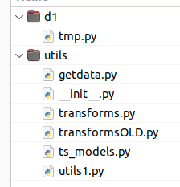

## utils package for Data 301
Packages:  In addition to normal anaconda distribution, you will probably need to install the names package
      
Usage:  Simplest is to add the path where this package is to the system path
        and then import the package
        ex.  For the following configuration

        

        tmp.py should contain the following lines
#the following gives access to utils folder
#where utils package stores shared code
import os
import sys
PROJECT_ROOT = os.path.abspath(os.path.join(
                  os.getcwd(),
                  os.pardir)
)

#only add it once
if (PROJECT_ROOT not in sys.path):
    sys.path.append(PROJECT_ROOT)

#now you can import from utils
from utils.transforms import *
